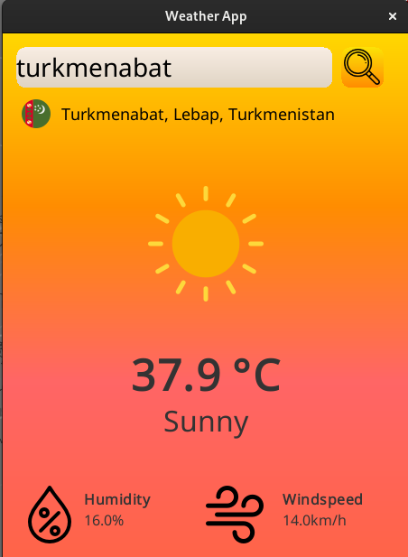
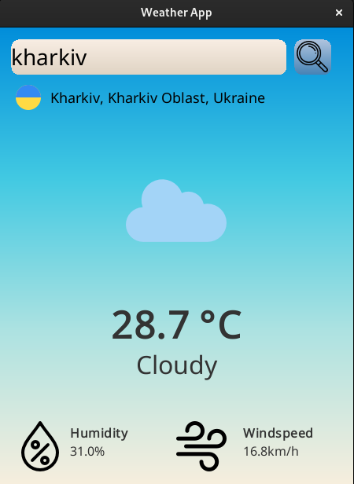
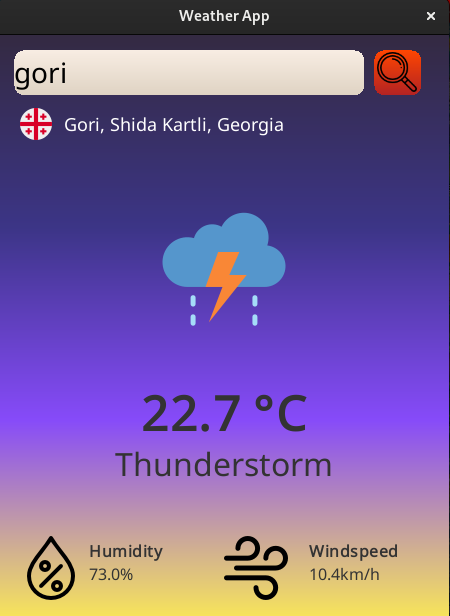
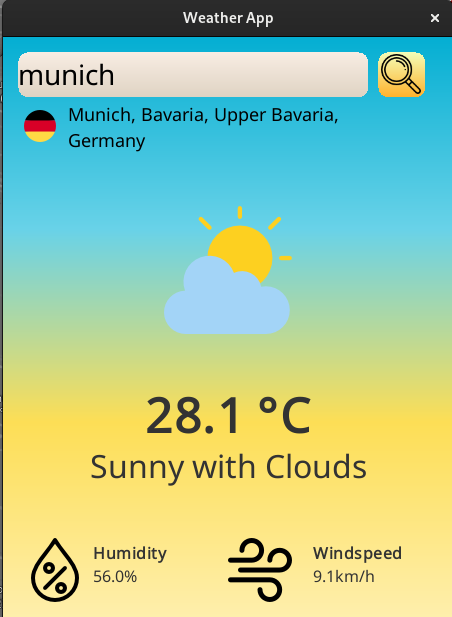
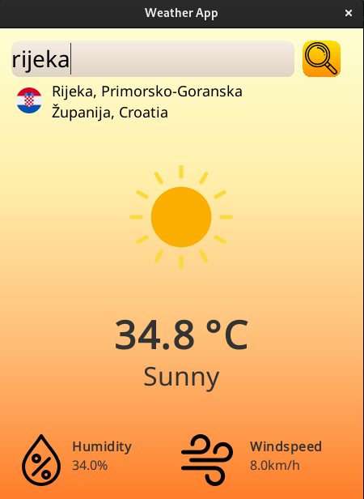
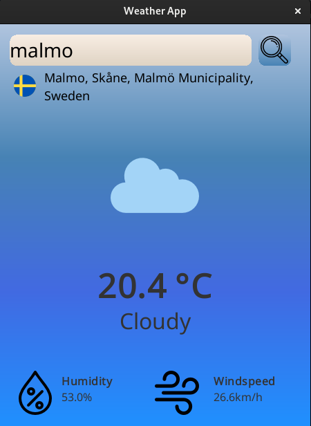

# 🌦️ Weather App

## 📜 Description

A Java desktop application that provides real-time weather information, including temperature, humidity, wind speed, and weather conditions, for any location in the world. The app features a dynamic GUI that adapts to current weather conditions and displays relevant weather icons, the full location name, and the country's flag. 🖥️🌍

## 📝 Notes

- Ensure you have Java 8 or later installed on your system. 🌟
- The `javac` and `java` commands require a properly configured Java Development Kit (JDK). 🛠️
- If you encounter any issues with missing dependencies, make sure all required libraries are included in the `lib` directory. 🔍

🛠️ **Usage**

1. **Enter a Location**: Type in the name of a city or region in the search field 🔍.
2. **View Weather Information**: The app displays:
   - **Temperature**: Current temperature in Celsius 🌡️.
   - **Humidity**: Current humidity percentage 💧.
   - **Wind Speed**: Current wind speed in km/h 🌬️.
   - **Weather Condition**: Icon and description of the weather condition ☁️🌞.
   - **Location Details**: Full location name and country flag 📍🏳️.

3. **Dynamic Background**: The background color and theme change based on the weather and temperature 🌈.

## 📁 Project Structure

- `src/` - Source code directory
  - `main/`
    - `java/` - Java source files
  - `test/` - Unit tests and test resources
- `assets/` - Image and icon assets
- `lib/` - External libraries

## 🖼️ Screenshots

  
  
  
  
   
  

## 📜 License
This project is licensed under the MIT License. See the [LICENSE](LICENCE) file for details. 📝

## 📬 Contact
For questions, feedback, or support:
- **Author**: Kacper Górski
- **LinkedIn**: [Kacper Górski](https://www.linkedin.com/in/kacper-gorski-se)
- **Instagram**: [@kxcper.gorski](https://www.instagram.com/kxcper.gorski)
- **X**: [@Kerciuu](https://x.com/Kerciuu)
- **GitHub**: [Kerciu](https://github.com/Kerciu)
- **Support**: Email [kacper.gorski.contact@gmail.com](mailto:kacper.gorski.contact@gmail.com)

For issues, please open a GitHub Issue. 🚀
